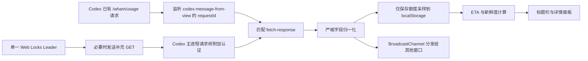

# 架构与行为

## 注入位置

当前 Codex 第一行标题栏是高度 36 CSS px 的应用菜单行。补丁查找 class token
`group/application-menu-top-bar`，把 `#is-codex-run-out-titlebar-slot` 追加为该 flex 行的普通子项。

- slot：`flex: 1 1 auto`、`-webkit-app-region: drag`
- widget：24 px 高、`-webkit-app-region: no-drag`
- 面板：只在点击时创建，关闭时销毁
- 原标题栏高度、第二行页面 header、侧栏和窗口按钮 DOM 不修改
- Owl 已有的窗口按钮安全 padding 和 `windowControlsOverlay` 区域继续生效

辅助头像窗口的实际 URL 带 `initialRoute=/avatar-overlay`，补丁已验证后明确跳过该窗口。

## 自适应布局

每次内容、slot 尺寸或窗口尺寸变化时，组件同步测量各显示档位所需的实际宽度。可用预算等于 slot 宽度减去 20% 拖动保留区，保留区最少 48 px、最多 160 px。按以下顺序选择第一个能完整放下的档位：

1. `full`：名称、剩余比例、进度、ETA、重置、异常状态
2. `reset`：隐藏异常状态
3. `eta`：再隐藏重置
4. `bar`：再隐藏 ETA
5. `compact`：名称和剩余比例
6. `percent`：仅剩余比例
7. `hidden`：没有安全空间时隐藏

正常 `fresh` 状态不创建标题栏状态文本。显示中的短字段不参与压缩；额度名称允许在 160 px 上限处截断。每次选档后还会检查 widget 是否位于 native titlebar area 内；不安全时直接隐藏。

## 数据流



补丁只在内存中短暂接触额度响应对象，归一化后丢弃原始对象。持久化内容不含完整响应、聊天、Prompt、回复、代码、Cookie 或令牌。

## 多窗口与轮询

- Web Locks `isCodexRunOut.poller.v1` 只允许一个窗口成为补充轮询 Leader。
- BroadcastChannel 分发快照、配置和手动刷新请求。
- 定时和手动刷新共享同一个 in-flight Promise。
- 手动刷新有 3 秒冷却；429 尊重 `Retry-After`；其他失败指数退避并带抖动，最多 30 分钟。
- 401/403 降为 30 分钟低频；字段不兼容时补充轮询停止。
- 离线停止，网络恢复按设置刷新；隐藏可暂停；失焦可按倍率或固定周期降频。
- 定时器检测较大漂移，系统恢复后重新计算下次计划，不补发积压请求。
- Codex 当前客户端自身约每分钟刷新 `rate-limit-status`。用户设置只控制补充轮询，不能也不会修改 Codex 原请求。

## 数据归一化

内部统一窗口字段：

```text
id, bucketId, limitId, limitName, kind, displayName,
usedPercent, remainingPercent, durationMinutes, resetsAt,
planType, rateLimitReachedType, spendControlReached, source
```

字段缺失、百分比超出 0–100 或结构无法识别时抛出 `CompatibilityError`，不生成默认百分比或虚构的 5 小时窗口。

## 历史与 ETA

历史按额度窗口保存采样时间、已用/剩余比例、重置时间、来源、有效性和请求状态。默认保留 30 天，每个窗口最多 5000 个样本。`localStorage.setItem` 是单 origin 内的同步原子替换；损坏 JSON 被移到带时间戳的隔离键后重建空历史。

ETA 只使用同一重置周期的有效样本：

- 至少 3 个变化样本、至少 2 分钟跨度、至少 2 个正向变化区间才输出具体 ETA。
- 重复不变样本压缩；持续不变时返回“无明显消耗”。
- 使用最近 6 小时相邻变化速率的中位数与本周期平均速率，权重 70%/30%。
- 使用真实采样时间，不假定固定轮询周期。
- 使用量下降超过 5 个百分点视为重置；60 秒内跳升超过 80 个百分点视为异常。
- 数据超过约 2 个有效轮询周期为 stale，超过约 5 个周期为 expired；expired 停止具体 ETA。
- ETA 晚于本周期重置时间时只返回 `safe-through-reset`。

## 补丁和回滚

商店安装目录全程只读。安装流程：

1. 探测 AppX、哈希、CSP、标题栏和数据锚点。
2. 在 `%LOCALAPPDATA%\isCodexRunOut\backups` 建立原版 ASAR 备份并核对 SHA-256。
3. 把完整 `app` 复制到随机 staging 目录。
4. 解包 staging ASAR，加入两个自有静态资源和 HTML 标记。
5. 按原版 37 个 unpacked 路径精确重打包。
6. 逐个核对 unpacked 集合和内容哈希、注入资源哈希及 HTML 标记。
7. 再次核对商店源哈希，最后原子重命名 staging 并写状态文件。

中途失败会删除 staging 和工作目录；商店源无需恢复，因为从未改写。恢复只接受“已记录补丁哈希”或“已记录原版哈希”，遇到第三种哈希直接拒绝覆盖。
