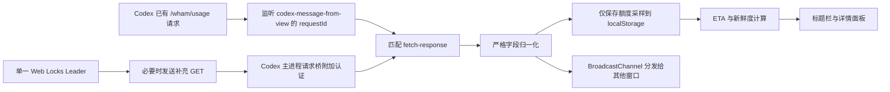

# 架构与行为

## 注入位置

当前 Codex 第一行标题栏是高度 36 CSS px 的应用菜单行。补丁查找 class token
`group/application-menu-top-bar`，把 `#is-codex-run-out-titlebar-slot` 追加为该 flex 行的普通子项。

- slot：`flex: 1 1 auto`、`-webkit-app-region: drag`
- widget：24 px 高、`-webkit-app-region: no-drag`
- widget 在 slot 内右对齐，位于原生窗口按钮安全区左侧；剩余拖动区域在其左侧
- 名称和百分比之间使用 opacity 0.45 的居中点 `·` 分隔，例如 `7d · 13%`
- 面板：只在点击时创建，关闭时销毁
- 原标题栏高度、第二行页面 header、侧栏和窗口按钮 DOM 不修改
- Owl 已有的窗口按钮安全 padding 和 `windowControlsOverlay` 区域继续生效

辅助头像窗口的实际 URL 带 `initialRoute=/avatar-overlay`，补丁已验证后明确跳过该窗口。

## 自适应布局

每次内容、slot 尺寸或窗口尺寸变化时，组件同步测量各显示档位所需的实际宽度。可用预算等于 slot 宽度减去 20% 拖动保留区，保留区最少 48 px、最多 160 px。按以下顺序选择第一个能完整放下的档位：

1. `full`：名称、剩余比例、进度、ETA、重置、异常状态
2. `reset`：隐藏异常状态
3. `eta`：再隐藏重置
4. `bar`：再隐藏 ETA
5. `compact`：名称和剩余比例
6. `percent`：仅剩余比例
7. `hidden`：没有安全空间时隐藏

正常 `fresh` 状态不创建标题栏状态文本。显示中的短字段不参与压缩；额度名称允许在 160 px 上限处截断。每次选档后还会检查 widget 是否位于 native titlebar area 内；不安全时直接隐藏。

## 数据流



补丁只在内存中短暂接触额度响应对象，归一化后丢弃原始对象。持久化内容不含完整响应、聊天、Prompt、回复、代码、Cookie 或令牌。

## 多窗口与轮询

- Web Locks `isCodexRunOut.poller.v1` 只允许一个窗口成为补充轮询 Leader。
- BroadcastChannel 分发快照、配置和手动刷新请求。
- 定时和手动刷新共享同一个 in-flight Promise。
- 手动刷新有 3 秒冷却；429 尊重 `Retry-After`；其他失败指数退避并带抖动，最多 30 分钟。
- 401/403 降为 30 分钟低频；字段不兼容时补充轮询停止。
- 离线停止，网络恢复按设置刷新；隐藏可暂停；失焦可按倍率或固定周期降频。
- 定时器检测较大漂移，系统恢复后重新计算下次计划，不补发积压请求。
- Codex 当前客户端自身约每分钟刷新 `rate-limit-status`。用户设置只控制补充轮询，不能也不会修改 Codex 原请求。

## 数据归一化

内部统一窗口字段：

```text
id, bucketId, limitId, limitName, kind, displayName,
usedPercent, remainingPercent, durationMinutes, resetsAt,
planType, rateLimitReachedType, spendControlReached, source
```

字段缺失、百分比超出 0–100 或结构无法识别时抛出 `CompatibilityError`，不生成默认百分比或虚构的 5 小时窗口。

## 历史与 ETA

历史按额度窗口保存采样时间、已用/剩余比例、重置时间、来源、有效性和请求状态。默认保留 30 天，每个窗口最多 5000 个样本。`localStorage.setItem` 是单 origin 内的同步原子替换；损坏 JSON 被移到带时间戳的隔离键后重建空历史。

历史仍按额度窗口留存，供诊断和趋势核对；ETA 本身不读取历史样本。估算模型为当前周期线性外推：

1. `上次重置 = 下次重置 - 窗口时长`。
2. `周期均速 = 当前已用百分比 / (当前时间 - 上次重置)`。
3. `剩余时间 = (100 - 当前已用百分比) / 周期均速`。
4. 预计耗尽晚于下次重置时返回 `safe-through-reset`。

缺少窗口时长或下次重置、当前时间不在周期内、当前使用量为零时不生成具体耗尽时间。数据超过约 2 个有效轮询周期为 stale，超过约 5 个周期为 expired；expired 停止具体 ETA。

## 远程控制兼容层

当前 Windows 构建含有远程连接界面，但该界面的
`showControlOtherDevices` 派生可见性受 gate `782640499` 关闭；主进程设备密钥
客户端同时只允许 macOS native addon。patcher 在真实 bundle 中分别处理这两个
锚点：

1. 只将该 gate 对应的派生可见性改为常量 true，不修改 gate 本身或其他使用点。
2. 将设备密钥客户端的 addon 加载位置替换为
   `resources/native/rc-device-key.cjs`。
3. 保持两个 bundle 字节长度不变，并要求锚点唯一；版本结构变化时 fail-fast。

Windows helper 生成 P-256 密钥，公开部分使用 SPKI DER，签名算法为
ECDSA P-256/SHA-256。PKCS#8 私钥经 Windows DPAPI CurrentUser 加密后写入
`remote-control-device-keys.windows.json`，不会以 PEM 明文落盘。

## 副本安装与卸载

一键安装流程：

1. 请求管理员权限，定位当前 `OpenAI.Codex` Store 包。
2. 将完整 Store 安装目录镜像到
   `%LOCALAPPDATA%\isCodexRunOut\codex_backup`。
3. 关闭所有 `ChatGPT.exe`，将 backup 镜像到活动目录
   `%LOCALAPPDATA%\isCodexRunOut\codex`。
4. 只在活动目录中构建候选 ASAR，校验标题栏、额度数据、远程控制锚点、
   37 个 unpacked 路径及内容哈希。
5. 将候选 ASAR 和设备密钥 helper 写入活动目录并再次核对 SHA-256。
6. 保存并重定向桌面/用户开始菜单快捷方式及两个用户环境变量。
7. 启动活动副本。

Store 源目录、文件 ACL 和 AppX 注册均不修改。每次 patch 都从当前 Store 版本重建
backup 和活动副本，因此补丁不会叠加到先前活动 ASAR。

卸载时恢复安装前记录的快捷方式和环境变量，删除两个托管副本及状态文件，然后从
AppsFolder 启动 Store 原版。已固定到开始菜单的 AppX 项不属于 `.lnk`，不能被脚本
改写；用户需要取消固定并固定新的用户开始菜单快捷方式。
