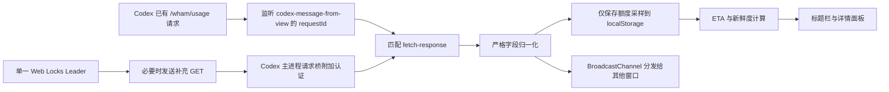

# 架构与行为

## 注入位置

当前 Codex 第一行标题栏是高度 36 CSS px 的应用菜单行。补丁查找 class token
`group/application-menu-top-bar`，把 `#is-codex-run-out-titlebar-slot` 追加为该 flex 行的普通子项。

- slot：`flex: 1 1 auto`、`-webkit-app-region: drag`
- widget：24 px 高、`-webkit-app-region: no-drag`
- widget 在 slot 内右对齐，位于原生窗口按钮安全区左侧；剩余拖动区域在其左侧
- 名称和百分比之间使用 opacity 0.45 的居中点 `·` 分隔，例如 `7d · 13%`
- 面板：只在点击时创建，关闭时销毁
- 原标题栏高度、第二行页面 header、侧栏和窗口按钮 DOM 不修改
- Owl 已有的窗口按钮安全 padding 和 `windowControlsOverlay` 区域继续生效

辅助头像窗口的实际 URL 带 `initialRoute=/avatar-overlay`，补丁已验证后明确跳过该窗口。

## 自适应布局

每次内容、slot 尺寸或窗口尺寸变化时，组件同步测量各显示档位所需的实际宽度。可用预算等于 slot 宽度减去 20% 拖动保留区，保留区最少 48 px、最多 160 px。按以下顺序选择第一个能完整放下的档位：

1. `full`：名称、剩余比例、进度、ETA、重置、异常状态
2. `reset`：隐藏异常状态
3. `eta`：再隐藏重置
4. `bar`：再隐藏 ETA
5. `compact`：名称和剩余比例
6. `percent`：仅剩余比例
7. `hidden`：没有安全空间时隐藏

正常 `fresh` 状态不创建标题栏状态文本。显示中的短字段不参与压缩；额度名称允许在 160 px 上限处截断。每次选档后还会检查 widget 是否位于 native titlebar area 内；不安全时直接隐藏。

## 数据流



补丁只在内存中短暂接触额度响应对象，归一化后丢弃原始对象。持久化内容不含完整响应、聊天、Prompt、回复、代码、Cookie 或令牌。

## 多窗口与轮询

- Web Locks `isCodexRunOut.poller.v1` 只允许一个窗口成为补充轮询 Leader。
- BroadcastChannel 分发快照、配置和手动刷新请求。
- 定时和手动刷新共享同一个 in-flight Promise。
- 手动刷新有 3 秒冷却；429 尊重 `Retry-After`；其他失败指数退避并带抖动，最多 30 分钟。
- 401/403 降为 30 分钟低频；字段不兼容时补充轮询停止。
- 离线停止，网络恢复按设置刷新；隐藏可暂停；失焦可按倍率或固定周期降频。
- 定时器检测较大漂移，系统恢复后重新计算下次计划，不补发积压请求。
- Codex 当前客户端自身约每分钟刷新 `rate-limit-status`。用户设置只控制补充轮询，不能也不会修改 Codex 原请求。

## 数据归一化

内部统一窗口字段：

```text
id, bucketId, limitId, limitName, kind, displayName,
usedPercent, remainingPercent, durationMinutes, resetsAt,
planType, rateLimitReachedType, spendControlReached, source
```

字段缺失、百分比超出 0–100 或结构无法识别时抛出 `CompatibilityError`，不生成默认百分比或虚构的 5 小时窗口。

## 历史与 ETA

历史按额度窗口保存采样时间、已用/剩余比例、重置时间、来源、有效性和请求状态。默认保留 30 天，每个窗口最多 5000 个样本。`localStorage.setItem` 是单 origin 内的同步原子替换；损坏 JSON 被移到带时间戳的隔离键后重建空历史。

历史仍按额度窗口留存，供诊断和趋势核对；ETA 本身不读取历史样本。估算模型为当前周期线性外推：

1. `上次重置 = 下次重置 - 窗口时长`。
2. `周期均速 = 当前已用百分比 / (当前时间 - 上次重置)`。
3. `剩余时间 = (100 - 当前已用百分比) / 周期均速`。
4. 预计耗尽晚于下次重置时返回 `safe-through-reset`。

缺少窗口时长或下次重置、当前时间不在周期内、当前使用量为零时不生成具体耗尽时间。数据超过约 2 个有效轮询周期为 stale，超过约 5 个周期为 expired；expired 停止具体 ETA。

## 原位补丁与卸载

当前模式直接修改 Store AppX 的 `app\resources\app.asar`，不创建原版备份。

一键脚本流程：

1. 请求管理员权限。
2. 定位当前 `OpenAI.Codex` 包和 `app.asar`，校验路径仍位于该包目录。
3. 关闭商店版和旧本地副本的所有 `ChatGPT.exe` 进程。
4. 用 `takeown` 和 `icacls` 临时取得目标文件写权限。
5. 在 `%LOCALAPPDATA%\isCodexRunOut\.tmp` 构建候选 ASAR。
6. 校验标题栏/数据锚点、37 个 unpacked 路径及内容哈希、补丁资源哈希和 HTML 标记。
7. 不创建备份，直接以候选 ASAR 覆盖当前 AppX 文件，再核对写入哈希。
8. 恢复继承 ACL 和 `TrustedInstaller` owner。
9. 删除旧的可写副本与备份目录，从标准 AppsFolder 入口重启 Codex。

卸载使用当前已 patch 的 ASAR作为输入，删除注入 HTML 和两个补丁资源，再执行同样的校验与原位覆盖。因此卸载只保证功能上移除补丁，不保证恢复 Store 原始 ASAR 的文件顺序或 SHA-256。

覆盖发生在最后一步，但该模式没有自动回滚来源。覆盖中发生磁盘或进程级故障时，只能使用 Microsoft Store 修复、重置或重装。
